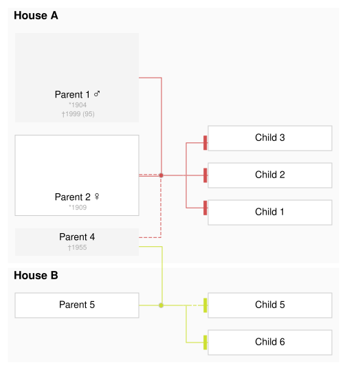
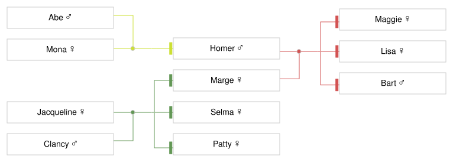
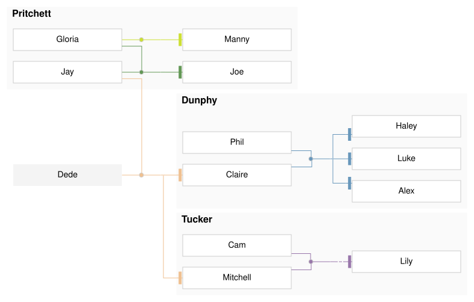
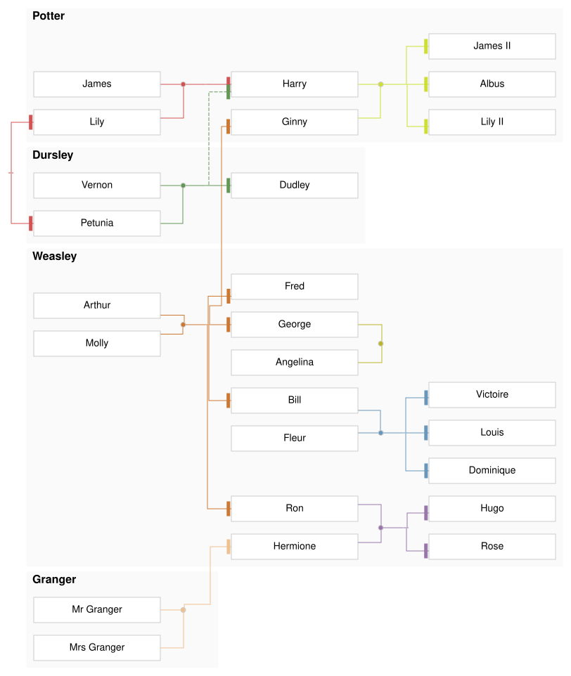
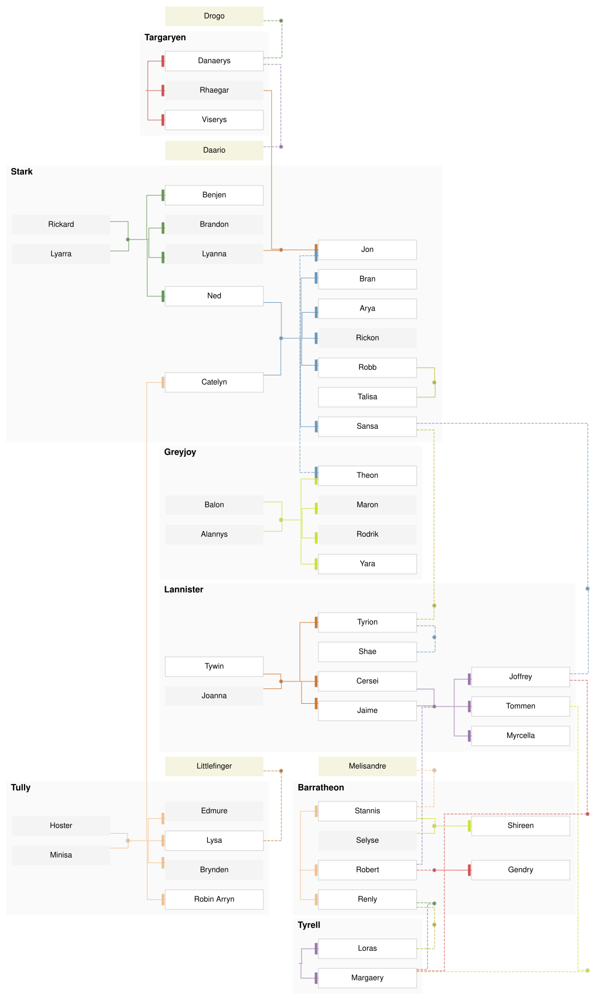

# kingraph

[](https://opensource.org/licenses/MIT)
[](https://github.com/alxflam/kingraph-ts/issues)
[](https://github.com/alxflam/kingraph-ts/actions/workflows/ci.yaml)

> 👪 Plots family trees using Go, Graphviz and LaTex

A family tree plotter with a very simple syntax. It probably doesn't cover everything [bigger tools](https://gramps-project.org/) do, but covers 90% of it for the sake of simplicity.



## Getting started

A family tree is a [YAML](http://yaml.org/) file. To get started, store the following text in a file called `family.yaml`:

```yaml
families:
  - parents: [Marge, Homer]
    children: [Bart, Lisa, Maggie]
  - parents: [Lisa, Milhouse]
    children: [Zia]

people:
  Marge:
    fullname: Marjorie Bouvier Simpson
```

Build the project and then run the CLI application to transform a YAML file into a Graphviz DOT file or SVG:

```sh
go mod tidy
go build -o kingraph ./cmd/kingraph
./kingraph -y ./examples/simpsons.yaml -f svg > out.svg
```

## Further Examples

Spoiler alerts, view at your own risk :)

<details>
<summary><b>Simpsons</b> (simple)</summary>

Source: *[simpsons.yaml](examples/simpsons.yaml)*

> 
</details>

<details>
<summary><b>Modern Family</b> (simple with houses)</summary>

Source: *[modernfamily.yaml](examples/modernfamily.yaml)*

> 
</details>

<details>
<summary><b>Harry Potter</b> (larger tree)</summary>

Source: *[potter.yaml](examples/potter.yaml)*

> 
</details>

<details>
<summary><b>Game of Thrones</b> (overly complicated)</summary>

Source: *[got.yaml](examples/got.yaml)*

> 
</details>

## Documentation

For further reading:

- [Getting started](docs/getting_started.md)
- [Advanced usage](docs/advanced.md)
- [Schema](docs/schema.md)

## Commands

Render DOT:

```sh
./kingraph -y ./examples/simpsons.yaml -f dot > out.dot
```

Render SVG (requires `dot`):

```sh
./kingraph -y ./examples/simpsons.yaml -f svg > out.svg
```

LaTeX fan chart:

```sh
./kingraph latexFanChart -y ./examples/simpsons.yaml --ancestorLeaf Homer --generations 4
```

Transform to GEDCOM:

```sh
./kingraph transform -y ./examples/simpsons.yaml -f gedcom > out.ged
```

Statistics:

```sh
./kingraph stats -y ./examples/simpsons.yaml
```

## Develop
Ensure you have go 1.26+ installed and run the following commands:

```sh
go mod tidy
go build -o kingraph ./cmd/kingraph
```

To execute tests and coverage run the following command:

```sh
go test ./...
```

To format the code run the following command:

```sh
go fmt ./...
```

To run the linter on the code run the following command:

```sh
go vet ./...
```

## Thanks

Authored and initially maintained by Rico Sta. Cruz in 2016 with help from [contributors](http://github.com/vorburger/kingraph/contributors).

Forked in 2022 by [vorburger](https://github.com/vorburger/kingraph).

Forked in 2024 by [alxflam](https://github.com/alxflam/kingraph-go), initially modernized and migrated to TypeScript, afterwards migrated to Go in 2026.
